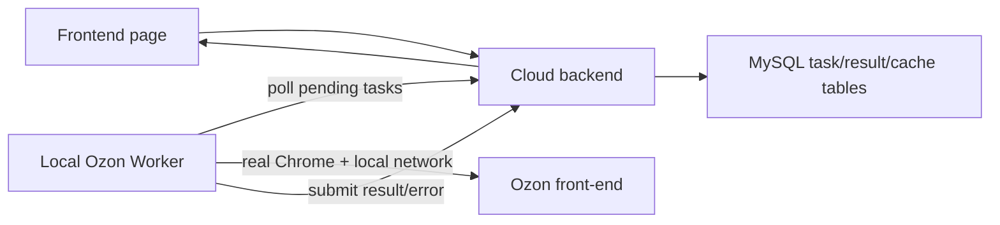

# Ozon Local Worker Design

## Background

Cloud deployment cannot reliably access Ozon front-end pages. Verified on the cloud host with visible Chrome, Xvfb, full cookies, and localStorage set to Chinese and CNY; Ozon still returned the network block page. The same cookie/localStorage data works from the user's local Chrome and returns normal search results.

The root issue is cloud exit IP reputation, not Python, cookies, or headless mode. Official Ozon Seller API features should remain server-side. Only Ozon front-end scraping tasks need a user-side browser executor.

## Goals

- Keep the cloud server as the main system for users, stores, database, configuration, cache, and UI.
- Move Ozon front-end browser work to a local worker running on the user's machine.
- Support the current high-risk front-end tasks first:
  - Ozon preference search.
  - Ozon product detail by URL.
  - Ozon product type extraction.
- Preserve existing script parsing logic where practical, but run it from the local worker's real Chrome/network.
- Make failure states explicit: no worker online, worker busy, cookie invalid, Ozon blocked, timeout, parse failure.

## Non-Goals

- Do not move the full project back to local deployment.
- Do not replace official Seller API sync tasks with local browser scraping.
- Do not solve cloud IP blocking with more Chrome flags.
- Do not require each user to install MySQL, Node backend, or the full project locally.

## Recommended Architecture

Use a cloud task queue plus a small local worker.

The cloud backend owns task records and exposes authenticated worker endpoints. The local worker polls for pending tasks, executes Ozon browser scripts using local Chrome, and posts results back. The frontend continues to call the cloud backend; pages do not talk directly to the worker.

## Alternatives Considered

### A. Cloud-only browser with visible Chrome

This was tested and failed. It solves browser fingerprint issues but not cloud IP reputation. It should not be the main path.

### B. Cloud server with shared proxy

This keeps scraping server-side but depends on proxy quality. It is operationally fragile and may mix all users through one risky exit. It is excluded from the first implementation and should only be reconsidered as a separate per-store network feature.

### C. Local worker per user

This keeps the cloud app independent while executing only Ozon front-end browser actions from the user's real environment. It is the recommended baseline because the local verification passed with the existing cookie and local Chrome.

## Data Model

Add a task table for Ozon front-end browser work.

Task fields:

- `id`: numeric task ID.
- `userId`: owner.
- `storeId`: optional Ozon store ID when the task belongs to a store.
- `type`: `preference_search`, `product_by_url`, `type_extract_batch`, `cookie_refresh`.
- `status`: `pending`, `claimed`, `running`, `success`, `failed`, `cancelled`, `expired`.
- `priority`: integer, higher runs first.
- `payload`: JSON input. Examples: keyword, category, limit, URL list.
- `result`: JSON output from the worker.
- `errorCode`: stable error code for UI and retry logic.
- `errorMessage`: user-readable error message.
- `workerId`: local worker that claimed the task.
- `claimedAt`, `startedAt`, `finishedAt`, `expiresAt`: lifecycle timestamps.
- `createdAt`, `updatedAt`: audit timestamps.

Add a worker registration table.

Worker fields:

- `id`: worker ID.
- `userId`: owner.
- `name`: display name, for example "办公室电脑".
- `tokenHash`: hashed worker token.
- `status`: `online`, `offline`, `disabled`.
- `capabilities`: JSON list such as `["ozon_search", "ozon_detail", "ozon_type"]`.
- `lastSeenAt`: heartbeat time.
- `createdAt`, `updatedAt`.

## API Design

User-facing backend APIs:

- `POST /api/ozon/browser-tasks`
  - Creates a task for the current user.
  - Used internally by Ozon preference search, manual product add, and type extraction services.
- `GET /api/ozon/browser-tasks/:id`
  - Returns task status and result.
- `GET /api/ozon/browser-workers`
  - Shows worker online/offline status.
- `POST /api/ozon/browser-workers`
  - Creates a worker token for the current user.

Worker APIs:

- `POST /api/worker/heartbeat`
  - Auth: worker token.
  - Updates worker status and capabilities.
- `POST /api/worker/tasks/claim`
  - Auth: worker token.
  - Claims one pending task for the worker's user.
- `POST /api/worker/tasks/:id/start`
  - Marks the task running.
- `POST /api/worker/tasks/:id/complete`
  - Saves result and marks success.
- `POST /api/worker/tasks/:id/fail`
  - Saves error and marks failed.

## Worker Design

The worker is a lightweight local script/app. The first implementation is a command-line worker. Installer packaging is explicitly out of scope for this implementation.

Config file:

- Cloud API base URL.
- Worker token.
- Chrome path or auto-detected Chrome.
- Local browser profile directory.
- Poll interval.

Runtime loop:

1. Send heartbeat.
2. Claim one task.
3. Execute task with visible or persistent local Chrome.
4. Submit result or failure.
5. Repeat.

The worker must reuse existing Ozon parsing scripts where possible:

- `backend/scripts/ozon/ozon_search.py`
- `backend/scripts/ozon/ozon_product_by_url.py`
- `backend/scripts/ozon/ozon_extract_type_batch.py`

The first worker implementation can vendor/copy only the required scripts and cookie file paths into a `worker/` package. Shared script extraction is excluded from the first implementation unless duplication blocks the worker CLI.

## Cookie and LocalStorage

Cookie remains local to the worker machine unless the user explicitly exports it. The cloud should not need to store Ozon front-end cookies for local-worker tasks.

Worker responsibilities:

- Use local Chrome profile or local worker cookie JSON.
- Ensure `lang=zh`, `language=zh`, and `currency=CNY` are set.
- Detect Ozon block pages.
- Report `OZON_ACCESS_BLOCKED` if the user's local network is also blocked.
- Report `COOKIE_EXPIRED` if Ozon redirects to login or returns insufficient page data.

## Integration With Existing Modules

### Ozon Preference Search

Current cloud flow:

1. Check cache.
2. If cache valid, return products.
3. If cache missing, run Python search script on server.

New flow:

1. Check cache.
2. If cache valid and count meets configured limit, return products.
3. If cache missing, create `preference_search` task.
4. If worker is online, frontend polls task status.
5. When task succeeds, save products to existing cache and return them.
6. Start type extraction as background `type_extract_batch` task.

### Manual Product Add

Current cloud flow runs `ozon_product_by_url.py` on server.

New flow creates a `product_by_url` task. The worker returns normalized product info. The backend continues validation and save logic.

### Type Extraction

Current backend starts a Python batch script and updates in-memory/file cache.

New flow creates a `type_extract_batch` task. The worker returns per-URL type/title updates. The backend updates the same search/type cache files and any existing database-backed records.

## UI Behavior

Pages that require Ozon front-end data should show worker status:

- Online: run normally.
- Offline: show "本机采集器未在线，无法访问 Ozon 前台页面".
- Running: show existing progress/loading UI.
- Failed: show the worker error message with retry.

The global app should not depend on the worker for official API modules such as orders, finance, product management, promotions, and messages.

## Security

- Worker token is scoped to one user.
- Store/task ownership is enforced by backend queries.
- Tokens are generated once and stored hashed.
- Worker cannot access other users' tasks.
- Worker result payloads are validated before being written to cache or database.
- Worker endpoints do not accept normal JWT as a substitute for worker token.

## Failure Handling

Error codes:

- `NO_WORKER_ONLINE`: no active worker for the current user.
- `WORKER_TIMEOUT`: task claimed but not finished before expiry.
- `OZON_ACCESS_BLOCKED`: local network is also blocked by Ozon.
- `COOKIE_EXPIRED`: Ozon login/cookie state is invalid.
- `LANGUAGE_CURRENCY_NOT_READY`: worker cannot force Chinese/CNY.
- `SCRIPT_PARSE_FAILED`: page opened but required fields were not extracted.
- `TASK_CANCELLED`: user cancelled or backend invalidated the task.

Pending or claimed tasks older than their expiry are marked `expired` and can be retried.

## Testing Strategy

Backend script tests:

- Task creation requires authenticated user.
- Worker token can claim only tasks belonging to its user.
- A disabled worker cannot claim tasks.
- Completing a task persists result and status.
- Failing a task persists error code/message.
- Expired claimed tasks are retried or marked expired.

Worker local smoke tests:

- Local worker can load `ozon_cookies.json`.
- Local worker can open Ozon search page and return product links.
- Worker detects Ozon block page and returns `OZON_ACCESS_BLOCKED`.

Integration smoke:

- Create preference search task.
- Run local worker once.
- Verify task becomes success.
- Verify backend can read result and write existing search cache.

## Rollout Plan

1. Add backend task and worker data model.
2. Add worker registration and task claim/complete APIs.
3. Add a minimal local worker CLI.
4. Wire preference search to create/poll worker tasks when server-side Ozon scraping is unavailable.
5. Wire manual product add and type extraction.
6. Add frontend worker status panel and module-level offline messages.
7. Disable cloud direct Ozon front-end scraping by default in production.
