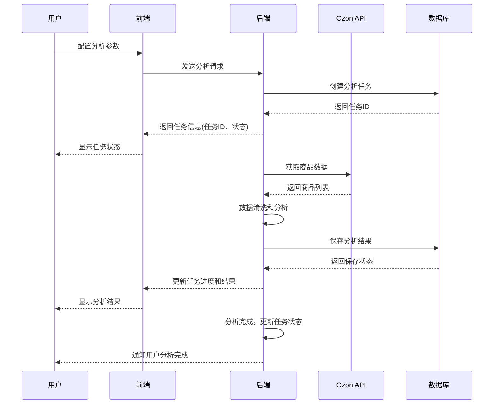

# Ozon跨境电商助手 - 选品分析实现逻辑

---

## 🎯 功能概述

### 选品分析目标
- 帮助用户在Ozon平台找到高潜力的商品
- 基于数据分析识别热销产品
- 提供商品的详细信息和市场分析
- 支持用户快速筛选和比较商品
- 提供数据驱动的决策建议

### 核心功能
1. **Ozon商品搜索和分析** - 实时获取商品数据
2. **关键词分析** - 热门关键词和趋势
3. **类目分析** - 各类目商品分布和表现
4. **竞品分析** - 类似商品的价格、销量、评价等对比
5. **市场趋势** - 商品销量和价格的历史趋势
6. **数据分析** - 综合评分和推荐

---

## 📐 技术架构

### 1. 系统架构
```
┌─────────────────────────────────────────────────────────┐
│                        前端层 (Vue)                     │
│  ┌───────────────────────────────────────────────────┐  │
│  │            选品分析页面组件                        │  │
│  ├───────────────────────────────────────────────────┤  │
│  │ 搜索栏 → 分类选择 → 筛选条件 → 商品列表 → 详情展示  │  │
│  └───────────────────────────────────────────────────┘  │
└────────────────────────────────────┬────────────────────┘
                                     │ HTTPS / RESTful API
                                     ↓
┌─────────────────────────────────────────────────────────┐
│                       后端层 (Node.js)                   │
│  ┌───────────────────────────────────────────────────┐  │
│  │            选品分析控制器和服务                      │  │
│  ├───────────────────────────────────────────────────┤  │
│  │ 搜索处理 → 数据清洗 → 分析计算 → 结果缓存 → 响应返回  │  │
│  └───────────────────────────────────────────────────┘  │
└────────────────────┬─────────────────────────────────────┘
                     │
         ┌───────────┼───────────┐
         ↓           ↓           ↓
┌──────────────┐ ┌──────────┐ ┌──────────┐
│    MySQL     │ │  Redis   │ │  Ozon API │
│  (存储分析数据)│ │(缓存数据) │ │(获取商品数据)│
└──────────────┘ └──────────┘ └──────────┘
```

---

## 📊 数据模型设计

### 1. 选品分析任务表
```sql
CREATE TABLE `analysis_tasks` (
  `id` INT PRIMARY KEY AUTO_INCREMENT,
  `user_id` INT NOT NULL,
  `type` VARCHAR(50) NOT NULL,
  `status` ENUM('pending', 'running', 'completed', 'failed') DEFAULT 'pending',
  `parameters` JSON NOT NULL,
  `progress` INT DEFAULT 0,
  `error_message` VARCHAR(255),
  `created_at` DATETIME DEFAULT CURRENT_TIMESTAMP,
  `updated_at` DATETIME DEFAULT CURRENT_TIMESTAMP ON UPDATE CURRENT_TIMESTAMP,
  FOREIGN KEY (`user_id`) REFERENCES `users`(`id`) ON DELETE CASCADE
) ENGINE=InnoDB DEFAULT CHARSET=utf8mb4 COMMENT='分析任务表';

-- 索引
CREATE INDEX idx_analysis_tasks_user_id ON analysis_tasks(user_id);
CREATE INDEX idx_analysis_tasks_status ON analysis_tasks(status);
CREATE INDEX idx_analysis_tasks_type ON analysis_tasks(type);
```

### 2. 分析结果表
```sql
CREATE TABLE `analysis_results` (
  `id` INT PRIMARY KEY AUTO_INCREMENT,
  `task_id` INT NOT NULL,
  `product_id` INT,
  `title` VARCHAR(255) NOT NULL,
  `price` DECIMAL(10,2) NOT NULL,
  `rating` DECIMAL(3,2),
  `reviews_count` INT,
  `sales_count` INT,
  `category` VARCHAR(255),
  `keywords` JSON,
  `score` DECIMAL(3,2),
  `ranking` INT,
  `metrics` JSON,
  `created_at` DATETIME DEFAULT CURRENT_TIMESTAMP,
  FOREIGN KEY (`task_id`) REFERENCES `analysis_tasks`(`id`) ON DELETE CASCADE,
  FOREIGN KEY (`product_id`) REFERENCES `products`(`id`) ON DELETE SET NULL
) ENGINE=InnoDB DEFAULT CHARSET=utf8mb4 COMMENT='分析结果表';

-- 索引
CREATE INDEX idx_analysis_results_task_id ON analysis_results(task_id);
CREATE INDEX idx_analysis_results_score ON analysis_results(score);
CREATE INDEX idx_analysis_results_category ON analysis_results(category);
CREATE INDEX idx_analysis_results_price ON analysis_results(price);
```

---

## 🚀 实现流程

### 1. 用户发起分析请求


---

## 🔍 Ozon API集成

### 1. API认证
```javascript
// 使用Ozon API需要的认证信息
// 在api_configs表中存储

// Ozon API配置示例
const ozonApiConfig = {
  client_id: '21345',
  api_key: 'abc123def456',
  api_version: 'v3'
}

// 认证头部
const headers = {
  'Client-Id': ozonApiConfig.client_id,
  'Api-Key': ozonApiConfig.api_key
}
```

### 2. 商品搜索API
```javascript
// 获取商品列表API
// 文档地址: https://docs.ozon.ru/api/seller/
// 使用场景: 关键词搜索和分类浏览

async function searchProducts(params) {
  const response = await axios.get('https://api-seller.ozon.ru/v3/product/info/search', {
    headers,
    params: {
      // 关键词搜索
      search: params.keyword,
      // 类目ID
      category_id: params.categoryId,
      // 价格范围
      price_min: params.priceMin,
      price_max: params.priceMax,
      // 评分范围
      rating_min: params.ratingMin,
      // 销量范围
      sales_min: params.salesMin,
      // 页码和数量
      page: params.page,
      page_size: params.pageSize || 20
    }
  })
  
  return response.data
}

// 响应示例
{
  "result": {
    "items": [
      {
        "product_id": 123456,
        "name": "Оригинальный телефон",
        "price": 29990,
        "rating": 4.8,
        "reviews_count": 1200,
        "sales_count": 5000,
        "category_id": 123,
        "images": [
          "https://img.ozon.ru/1.jpg"
        ],
        "seller_info": {
          "id": 98765,
          "name": "Официальный магазин"
        }
      }
    ],
    "total": 500,
    "page": 1,
    "page_size": 20
  }
}
```

### 3. 商品详细信息API
```javascript
// 获取商品详情API
// 使用场景: 查看商品详细信息和规格参数

async function getProductDetails(productId) {
  const response = await axios.get(`https://api-seller.ozon.ru/v3/product/info/${productId}`, {
    headers
  })
  
  return response.data
}
```

### 4. 分类信息API
```javascript
// 获取类目信息API
// 使用场景: 分析和展示商品所属类目

async function getCategories(categoryId) {
  const response = await axios.get('https://api-seller.ozon.ru/v3/category/info', {
    headers,
    params: {
      category_id: categoryId
    }
  })
  
  return response.data
}
```

---

## 📈 数据分析算法

### 1. 商品综合评分
```javascript
// 商品综合评分算法
function calculateProductScore(product, marketData) {
  // 价格分数 (30%) - 价格竞争力
  const priceScore = calculatePriceScore(product.price, marketData)
  
  // 销量分数 (25%) - 市场需求
  const salesScore = calculateSalesScore(product.sales_count, marketData)
  
  // 评价分数 (20%) - 产品质量
  const ratingScore = calculateRatingScore(product.rating, product.reviews_count)
  
  // 增长潜力分数 (15%) - 销售趋势
  const growthScore = calculateGrowthScore(product.trend)
  
  // 利润率分数 (10%) - 盈利能力
  const profitScore = calculateProfitScore(product.profit_margin)
  
  // 总分 = 各指标权重和
  return (
    priceScore * 0.30 +
    salesScore * 0.25 +
    ratingScore * 0.20 +
    growthScore * 0.15 +
    profitScore * 0.10
  )
}
```

### 2. 价格竞争力分析
```javascript
// 价格分数计算
function calculatePriceScore(productPrice, marketData) {
  // 同类商品价格范围
  const priceRange = marketData.priceRange
  const averagePrice = marketData.averagePrice
  
  // 价格高于平均价20% - 分数低
  if (productPrice > averagePrice * 1.2) return 0.2
  
  // 价格低于平均价20% - 分数高
  if (productPrice < averagePrice * 0.8) return 0.9
  
  // 价格在合理范围内 - 中等分数
  return 0.6 + (averagePrice - productPrice) / averagePrice * 0.4
}
```

### 3. 销量和需求分析
```javascript
// 销量分数计算
function calculateSalesScore(salesCount, marketData) {
  const maxSales = marketData.maxSales
  const medianSales = marketData.medianSales
  
  if (salesCount >= maxSales) return 1.0
  
  if (salesCount >= medianSales * 2) return 0.8
  
  if (salesCount >= medianSales) return 0.6
  
  if (salesCount >= medianSales * 0.5) return 0.4
  
  return 0.2
}
```

### 4. 产品质量分析
```javascript
// 评分分数计算
function calculateRatingScore(rating, reviewCount) {
  // 评分分数 (0.0-0.5)
  const baseScore = Math.max(0, (rating - 3) / 2)
  
  // 评价数量分数 (0.0-0.5)
  // 评价数量越多，分数越高
  const reviewScore = reviewCount > 1000 ? 0.5 : (reviewCount / 1000) * 0.5
  
  return baseScore + reviewScore
}
```

### 5. 增长潜力分析
```javascript
// 增长潜力计算
function calculateGrowthScore(trendData) {
  // trendData 包含每周销量增长率
  const weeklyGrowth = trendData.growthRate
  
  if (weeklyGrowth > 0.3) return 0.9  // 高增长
  
  if (weeklyGrowth > 0.15) return 0.7  // 中等增长
  
  if (weeklyGrowth > 0.05) return 0.5  // 低增长
  
  if (weeklyGrowth > -0.1) return 0.3  // 稳定
  
  return 0.1  // 下降
}
```

### 6. 利润率分析
```javascript
// 利润率计算
function calculateProfitScore(profitMargin) {
  if (profitMargin > 0.4) return 1.0  // 高利润率
  
  if (profitMargin > 0.25) return 0.8  // 较高利润率
  
  if (profitMargin > 0.15) return 0.6  // 中等利润率
  
  if (profitMargin > 0.05) return 0.4  // 低利润率
  
  return 0.1  // 负利润
}
```

---

## 🎨 前端实现方案

### 1. 搜索和筛选组件
```vue
<!-- SearchFilter.vue -->
<template>
  <Card title="搜索和筛选">
    <div class="space-y-4">
      <!-- 关键词搜索 -->
      <div>
        <Input
          v-model="searchParams.keyword"
          placeholder="输入关键词..."
          icon="search"
          @enter="performSearch"
        />
      </div>
      
      <!-- 分类选择 -->
      <div>
        <label>类目:</label>
        <Select v-model="searchParams.categoryId" placeholder="选择类目">
          <Option label="全部" value=""></Option>
          <Option label="电子产品" value="123"></Option>
          <Option label="服装鞋帽" value="456"></Option>
          <Option label="家居用品" value="789"></Option>
        </Select>
      </div>
      
      <!-- 价格范围 -->
      <div>
        <label>价格范围 (RUB):</label>
        <RangeSlider
          v-model="priceRange"
          :min="0"
          :max="50000"
          @change="updatePriceRange"
        />
        {{ priceRange[0] }} - {{ priceRange[1] }} RUB
      </div>
      
      <!-- 销量范围 -->
      <div>
        <label>最低销量:</label>
        <Select v-model="searchParams.salesMin">
          <Option label="无限制" value="0"></Option>
          <Option label="100+" value="100"></Option>
          <Option label="500+" value="500"></Option>
          <Option label="1000+" value="1000"></Option>
        </Select>
      </div>
      
      <!-- 评分范围 -->
      <div>
        <label>最低评分:</label>
        <Slider
          v-model="searchParams.ratingMin"
          :min="0"
          :max="5"
          :step="0.1"
        />
        {{ searchParams.ratingMin }} 分
      </div>
      
      <!-- 搜索按钮 -->
      <div class="pt-4">
        <Button type="primary" @click="performSearch" :loading="loading">
          {{ loading ? '搜索中...' : '搜索商品' }}
        </Button>
      </div>
    </div>
  </Card>
</template>

<script setup lang="ts">
import { ref, computed } from 'vue'
import { useProductAnalysisStore } from '@/stores/productAnalysis'

const store = useProductAnalysisStore()
const loading = ref(false)
const priceRange = ref([0, 50000])

const searchParams = ref({
  keyword: '',
  categoryId: '',
  priceMin: 0,
  priceMax: 50000,
  salesMin: 0,
  ratingMin: 0,
  page: 1,
  pageSize: 20
})

const updatePriceRange = () => {
  searchParams.value.priceMin = priceRange.value[0]
  searchParams.value.priceMax = priceRange.value[1]
}

const performSearch = async () => {
  loading.value = true
  try {
    await store.searchProducts(searchParams.value)
  } catch (error) {
    console.error('搜索失败:', error)
  } finally {
    loading.value = false
  }
}
</script>
```

### 2. 商品列表和分析结果
```vue
<!-- ProductList.vue -->
<template>
  <Card title="搜索结果" :loading="loading">
    <Table
      :columns="columns"
      :data="filteredProducts"
      :loading="loading"
      @row-click="showProductDetails"
    >
      <template #cell-ranking="{ row }">
        <div class="flex items-center">
          <span class="rank-number {{ getRankClass(row.ranking) }}">{{ row.ranking }}</span>
        </div>
      </template>
      
      <template #cell-title="{ row }">
        <div class="flex items-start space-x-2">
          
          <div class="flex-1">
            <h3 class="font-medium">{{ row.title }}</h3>
            <p class="text-sm text-gray-500 truncate">{{ row.category }}</p>
          </div>
        </div>
      </template>
      
      <template #cell-price="{ row }">
        <div class="text-right">
          <div class="font-bold text-lg">{{ formatPrice(row.price) }}</div>
          <div class="text-sm text-gray-500">{{ formatProfit(row.profit_margin) }}</div>
        </div>
      </template>
      
      <template #cell-score="{ row }">
        <div class="text-center">
          <div class="score-display" :style="{ background: getScoreColor(row.score) }">
            {{ Math.round(row.score * 100) }}
          </div>
        </div>
      </template>
      
      <template #cell-actions="{ row }">
        <Button type="text" @click.stop="addToCandidate(row)">
          <Icon name="plus" /> 收藏
        </Button>
        <Button type="text" @click.stop="viewDetails(row)">
          <Icon name="eye" /> 查看
        </Button>
      </template>
    </Table>
    
    <!-- 分页 -->
    <div v-if="total > 0" class="flex justify-center pt-4">
      <Pagination
        :total="total"
        :page-size="pageSize"
        :current-page="currentPage"
        @page-change="onPageChange"
      />
    </div>
    
    <!-- 无结果 -->
    <div v-if="!loading && total === 0" class="text-center py-12 text-gray-500">
      <Icon name="search" size="48" class="mx-auto mb-4" />
      <p>未找到符合条件的商品</p>
      <p class="text-sm mt-2">请尝试调整搜索条件</p>
    </div>
  </Card>
</template>

<script setup lang="ts">
import { ref, computed } from 'vue'
import { useProductAnalysisStore } from '@/stores/productAnalysis'

const store = useProductAnalysisStore()

const loading = computed(() => store.isLoading)
const products = computed(() => store.products)
const total = computed(() => store.total)

const formatPrice = (price) => {
  return new Intl.NumberFormat('ru-RU', {
    style: 'currency',
    currency: 'RUB'
  }).format(price)
}

const formatProfit = (margin) => {
  return margin > 0 ? `${margin * 100}% 利润` : '无数据'
}

const getScoreColor = (score) => {
  if (score >= 0.8) return '#10b981'  // 绿色 - 高评分
  if (score >= 0.6) return '#3b82f6'  // 蓝色 - 中等评分
  if (score >= 0.4) return '#f59e0b'  // 黄色 - 一般评分
  return '#ef4444'  // 红色 - 低评分
}

const getRankClass = (rank) => {
  if (rank === 1) return 'rank-1'
  if (rank <= 3) return 'rank-top3'
  if (rank <= 10) return 'rank-top10'
  return ''
}
</script>
```

---

## 📊 数据展示组件

### 1. 商品详情弹窗
```vue
<!-- ProductDetails.vue -->
<template>
  <Modal v-model:visible="visible" width="70%" :title="product?.title" @cancel="visible = false">
    <div v-if="product" class="space-y-6">
      <div class="grid grid-cols-2 gap-4">
        <div>
          <h3>基本信息</h3>
          <p><strong>价格:</strong> {{ formatPrice(product.price) }}</p>
          <p><strong>评分:</strong> {{ product.rating }}</p>
          <p><strong>评价数:</strong> {{ product.reviews_count }}</p>
          <p><strong>销量:</strong> {{ product.sales_count }}</p>
          <p><strong>类目:</strong> {{ product.category }}</p>
          <p><strong>综合评分:</strong> {{ (product.score * 100).toFixed(0) }}</p>
        </div>
        
        <div>
          <h3>市场分析</h3>
          <p><strong>价格竞争力:</strong> {{ getPriceCompetitive(product.price) }}</p>
          <p><strong>销量趋势:</strong> {{ product.trend.growth_rate }}%</p>
          <p><strong>利润率:</strong> {{ product.profit_margin }}%</p>
          <p><strong>库存状况:</strong> {{ product.stock_status }}</p>
        </div>
      </div>
      
      <div>
        <h3>图片预览</h3>
        <div class="grid grid-cols-3 gap-2">
          
        </div>
      </div>
      
      <div>
        <h3>商品规格</h3>
        <div class="grid grid-cols-2 gap-4">
          <div v-for="(spec, key) in product.specifications" :key="key">
            <span class="font-medium">{{ key }}:</span> {{ spec }}
          </div>
        </div>
      </div>
      
      <div>
        <h3>评论精选</h3>
        <div class="space-y-2">
          <div v-for="review in product.reviews.slice(0, 3)" :key="review.id">
            <p><strong>{{ review.author }}:</strong> {{ review.rating }}分</p>
            <p>{{ review.text }}</p>
          </div>
        </div>
        <a href="#" class="text-blue-500">查看更多评论</a>
      </div>
      
      <div class="flex justify-end space-x-2">
        <Button @click="visible = false">取消</Button>
        <Button type="primary" @click="addToCandidate(product)">
          <Icon name="plus" /> 添加到候选
        </Button>
      </div>
    </div>
  </Modal>
</template>

<script setup lang="ts">
import { ref, computed } from 'vue'

const visible = ref(false)
const product = ref(null)

// 使用方法
const showProductDetails = (productData) => {
  product.value = productData
  visible.value = true
}

// 获取价格竞争力信息
const getPriceCompetitive = (price) => {
  // 简化实现
  const avgPrice = 25000
  if (price < avgPrice * 0.8) return '价格优势明显'
  if (price < avgPrice * 0.95) return '价格具有竞争力'
  if (price <= avgPrice * 1.05) return '价格适中'
  return '价格较高'
}
</script>
```

---

## 🛠️ 工具函数和帮助方法

### 1. 价格格式化
```javascript
// 价格格式化工具
const formatPrice = (price, currency = 'RUB') => {
  return new Intl.NumberFormat('ru-RU', {
    style: 'currency',
    currency: currency
  }).format(price)
}

// 评分格式化
const formatRating = (rating) => {
  return rating.toFixed(1) + '分'
}

// 数量格式化
const formatCount = (count) => {
  if (count >= 1000) {
    return (count / 1000).toFixed(1) + 'K'
  }
  return count.toString()
}
```

### 2. 数据排序和过滤
```javascript
// 按综合评分排序
const sortByScore = (products) => {
  return [...products].sort((a, b) => b.score - a.score)
}

// 按销量排序
const sortBySales = (products) => {
  return [...products].sort((a, b) => b.sales_count - a.sales_count)
}

// 按价格排序
const sortByPrice = (products, order = 'asc') => {
  return [...products].sort((a, b) => 
    order === 'asc' ? a.price - b.price : b.price - a.price
  )
}
```

### 3. 商品筛选函数
```javascript
// 根据评分筛选
const filterByRating = (products, minRating) => {
  return products.filter(p => p.rating >= minRating)
}

// 根据销量筛选
const filterBySales = (products, minSales) => {
  return products.filter(p => p.sales_count >= minSales)
}

// 根据价格范围筛选
const filterByPrice = (products, priceRange) => {
  return products.filter(p => 
    p.price >= priceRange[0] && p.price <= priceRange[1]
  )
}
```

---

## 🔧 配置和部署

### 1. API配置
```env
# .env
OZON_API_URL=https://api-seller.ozon.ru
OZON_API_VERSION=v3
# 用户配置在数据库中
# 每次API请求时动态获取
```

### 2. 缓存策略
```javascript
// Redis缓存配置
// 商品搜索结果缓存 10分钟
const searchCacheTTL = 600

// 商品详情缓存 1小时
const detailCacheTTL = 3600

// 类目信息缓存 24小时
const categoryCacheTTL = 86400

// 使用方法
const cacheKey = `search:${hashKey}`
const cached = await redisClient.get(cacheKey)

if (cached) {
  return JSON.parse(cached)
} else {
  const data = await fetchData()
  await redisClient.set(cacheKey, JSON.stringify(data), 'EX', searchCacheTTL)
  return data
}
```

---

## 📊 监控和日志

### 1. 性能监控
```javascript
// 使用 Winston 记录关键操作
const logger = winston.createLogger({
  format: winston.format.json(),
  transports: [
    new winston.transports.File({ filename: 'error.log', level: 'error' }),
    new winston.transports.File({ filename: 'combined.log' })
  ]
})

// 记录API调用
const start = Date.now()
try {
  const response = await axios.get(url)
  logger.info('API call succeeded', {
    api: 'searchProducts',
    duration: Date.now() - start,
    status: response.status
  })
  return response.data
} catch (error) {
  logger.error('API call failed', {
    api: 'searchProducts',
    duration: Date.now() - start,
    error: error.message
  })
  throw error
}
```

### 2. 分析任务监控
```javascript
// 分析任务状态监控
function monitorAnalysisTask(taskId) {
  return new Promise((resolve, reject) => {
    const interval = setInterval(async () => {
      const task = await getTaskById(taskId)
      
      if (task.status === 'completed') {
        clearInterval(interval)
        resolve(getTaskResults(taskId))
      } else if (task.status === 'failed') {
        clearInterval(interval)
        reject(new Error(task.error_message))
      }
    }, 5000)
  })
}
```

---

## 🚀 性能优化建议

### 1. 数据加载优化
- 使用分页和懒加载
- 图片懒加载和预加载
- 数据压缩和最小化传输
- 合理使用CDN加速

### 2. 渲染优化
- 虚拟滚动处理长列表
- 组件懒加载
- 避免不必要的重渲染
- 使用CDN优化资源加载

### 3. 错误处理和重试
- API调用失败自动重试
- 网络连接检测和重连
- 用户友好的错误提示
- 数据验证和边界检查

---

## 🔐 安全考虑

### 1. API安全
- 请求签名和验证
- 调用频率限制
- IP白名单
- 请求数据验证

### 2. 数据安全
- 敏感信息加密
- 访问权限控制
- 审计日志
- 数据备份和恢复

---

## 📈 数据分析和报表

### 1. 每日分析报告
```javascript
async function generateDailyReport() {
  const topProducts = await getTopProductsByCategory()
  const keywordTrends = await getKeywordTrends()
  const marketAnalysis = await getMarketAnalysis()
  
  const report = {
    date: new Date(),
    topProducts,
    keywordTrends,
    marketAnalysis,
    recommendations: await getRecommendations()
  }
  
  await saveReport(report)
  return report
}
```

### 2. 推送通知
```javascript
async function sendDailyReport(user) {
  const report = await generateDailyReport()
  
  // 通过邮件或消息推送
  await emailService.send({
    to: user.email,
    subject: '每日Ozon选品分析报告',
    template: 'daily-report',
    data: report
  })
}
```

---

## 🎯 使用建议

### 1. 最佳使用场景
- 新手卖家: 从高评分、高销量商品开始
- 经验卖家: 关注高增长潜力商品
- 成本敏感: 关注价格优势和库存周转率
- 风险厌恶: 关注低退货率和稳定销量

### 2. 数据分析维度
- **热销商品**: 销量高、评价好、评分高
- **潜力商品**: 增长快、竞争少、利润高
- **机会商品**: 季节性、节日相关、新品
- **风险商品**: 价格波动大、库存高、退货多
